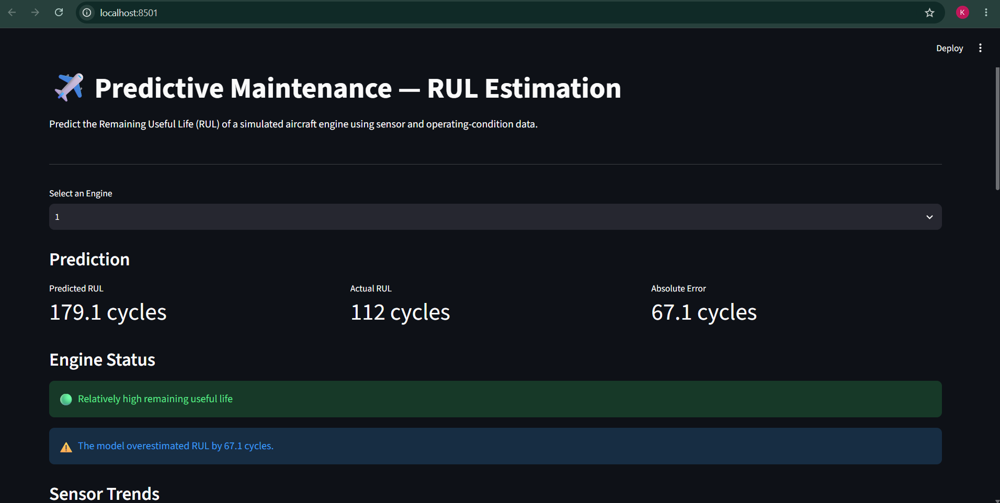

# Predictive Maintenance and Remaining Useful Life (RUL) Estimation

## 📌 Project Overview

This project develops a machine learning system to estimate the Remaining Useful Life (RUL) of aircraft engines using sensor and operating-condition data.

The project uses the NASA C-MAPSS FD001 dataset, which contains simulated aircraft engine run-to-failure trajectories.

The goal is to predict how many operating cycles an engine has remaining before failure.

---

## 🎯 Problem Statement

Unexpected equipment failure can result in downtime, maintenance costs, and operational disruption.

Predictive maintenance aims to estimate equipment health before failure occurs.

In this project, a regression model is used to estimate the Remaining Useful Life (RUL) of an aircraft engine from its observed operating conditions and sensor measurements.

---

## 📊 Dataset

**Dataset:** NASA C-MAPSS FD001

FD001 contains:

- 100 training engines
- 100 test engines
- 1 operating condition
- 1 degradation mode
- Multiple sensor measurements recorded over operating cycles

The training engines contain complete run-to-failure trajectories, while the test trajectories are truncated and their true RUL values are provided separately.

> Note: C-MAPSS is a simulated dataset designed to represent realistic engine degradation behavior.

---

## 🔧 Methodology

The project follows this workflow:

1. Data loading
2. Data cleaning
3. Exploratory Data Analysis
4. Removal of constant features
5. RUL calculation for training engines
6. Engine-level train/validation splitting
7. Model comparison
8. Gradient Boosting model training
9. Hyperparameter tuning
10. Model evaluation
11. Feature importance analysis
12. SHAP explainability
13. Streamlit dashboard development

---

## 🤖 Machine Learning Model

The final model is a:

**Gradient Boosting Regressor**

The model uses 18 features including:

- Operating cycle
- Operating settings
- Selected engine sensor measurements

The final deployment model was retrained using the complete training dataset after the evaluation process.

---

## 📈 Model Evaluation

The model was evaluated on a held-out engine-level test split.

| Metric | Result |
|---|---:|
| MAE | 18.44 cycles |
| RMSE | 25.37 cycles |
| R² | 0.627 |

### Metric interpretation

**MAE (Mean Absolute Error)** measures the average absolute difference between predicted and actual RUL.

**RMSE (Root Mean Squared Error)** penalizes larger prediction errors more strongly.

**R² (Coefficient of Determination)** measures how much of the variation in RUL is explained by the model.

---

## 🔍 Explainability

SHAP (SHapley Additive exPlanations) was used to understand how individual features influence model predictions.

Feature importance analysis showed that operating cycle was the dominant feature, followed by several engine sensor measurements.

This is important because it helps explain why the model produces a particular RUL prediction rather than treating the model as a complete black box.

---

## 🖥️ Interactive Dashboard

A Streamlit dashboard was developed to allow users to:

- Select an engine
- View predicted RUL
- Compare predicted RUL with actual RUL
- View absolute prediction error
- Interpret whether the model overestimated or underestimated RUL
- Visualize sensor trends
- View engine sensor values
- View model evaluation metrics

### Dashboard



---

## 🛠️ Technologies Used

- Python
- Pandas
- NumPy
- Scikit-learn
- SHAP
- Joblib
- Streamlit
- Matplotlib / visualization tools
- Jupyter Notebook

---

## 📁 Project Structure

```text
predictive-maintenance-rul/
│
├── data/
│   ├── RUL_FD001.txt
│   └── test_FD001.txt
│
├── images/
│
├── notebooks/
│
├── app.py
├── requirements.txt
├── rul_model.pkl
├── .gitignore
└── README.md